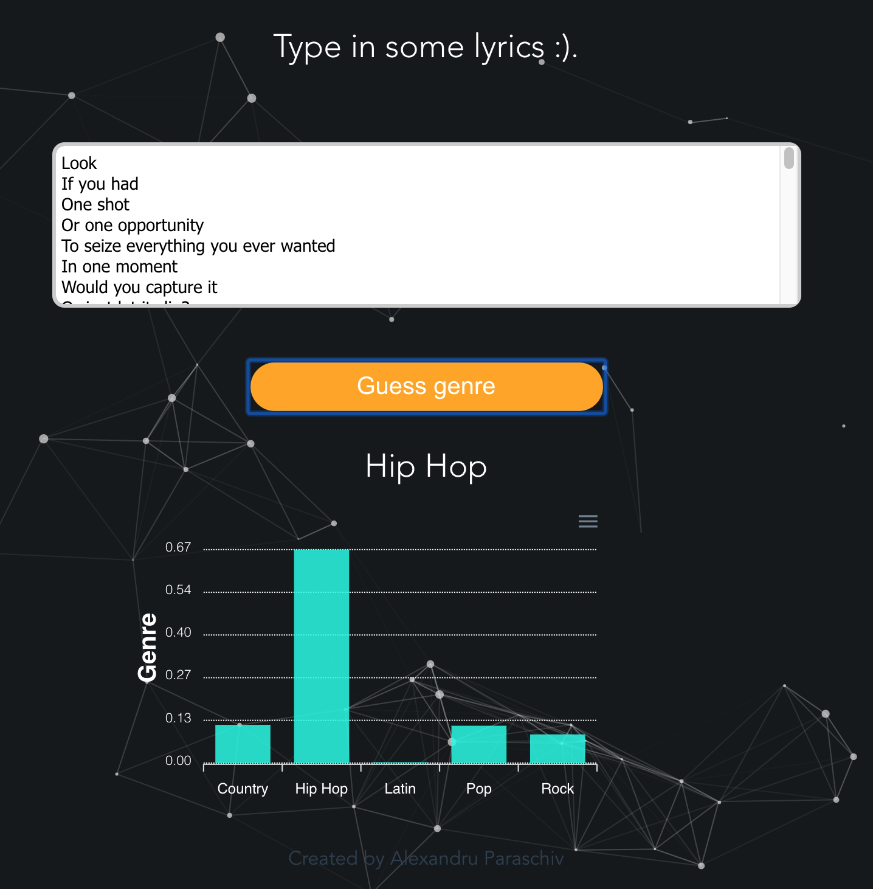

# Lyrrio

[](https://travis-ci.org/joemccann/dillinger)   [](https://opensource.org/licenses/MIT)


Lyrrio is a machine-learning powered web-application that can predict the musical genre of some given lyrics. Lyrrio was built by  first scraping song lyrics using the Python library BeautifulSoup. Then, the songs are converted to a vectorized form (each word representing a row) The algorithm behind Lyrrio's classification is simple TF-IDF (term frequency-inverse term frequency) coupled with a regularised logistic regression. This model outperformed SVMs and Naive-Bayes methods.  Only boosted tree-based methods (such as XGBoost) scored a higher accuracy (measured by accuracy and mean F-score), but due to the computational cost, they were not used in this model.


<p align="center">
  
</p>

Pull requests and suggestions are welcome. 

### Set-up

Lyrrio is easy to set-up locally using docker-compose. Both the front-end and the back-end are served from their respective Docker containers. To make the app work locally, first change the axios POST url inside the LyricsForm.vue component to 'https://localhost5000:/predict'.

Then, set up the corresponding docker-containers:

```sh
cd lyrrio
docker-compose up
```

Verify the deployment by navigating to your server address in your preferred browser at:

```sh
https://localhost:8080
```

The app should now be up and able to predict the musical genre.

### Todos

 - Add back-end automatic tests using py.test fixtures.
 - Acquire more data.
 - Use to more sophisticated models such as word2vec, GloVe embeddings and attention-based models such as BERT and ELMO.
 - Deploy to  a GCP cluster using Kubernetes

License
----

MIT

